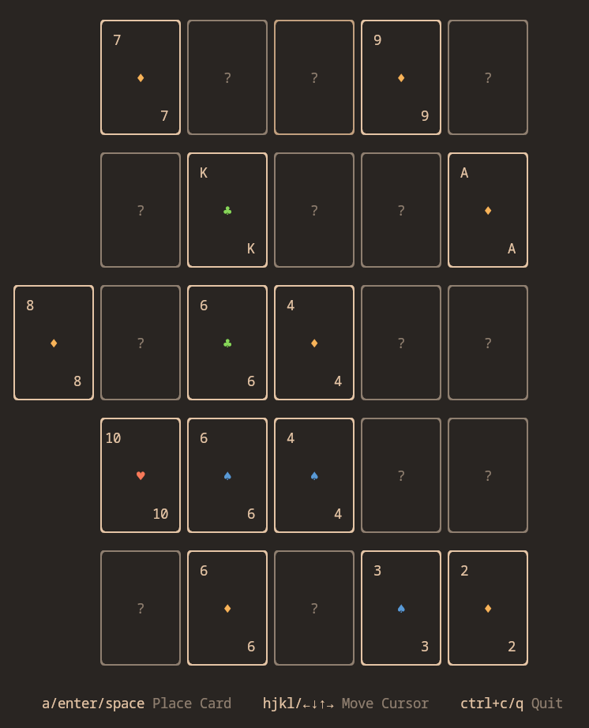

<div align="center">

# antecli

**Poker Solitaire but in your terminal**



</div>

## Install
```sh
go install github.com/Kyohans/antecli
antecli # Ensure GOPATH is added to your PATH
```

## How to play

You can place a card on any unoccupied square. After all 25 squares are filled, poker hands on each row and column are summed up for the final score.

## Scoring

| Poker Hand      |                         Matches                           | Points  |
| --------------- | --------------------------------------------------------  | ------- |
| High Card       | Nothing                                                   | 1       |
| Pair            | Two of the same rank                                      | 2       |
| Two Pair        | Two pairs                                                 | 5       |
| Three Of A Kind | Three of the same rank                                    | 10      |
| Straight        | Hand consists of consecutive ranks                        | 15      |
| Flush           | Hand consists of same suit                                | 20      |
| Full House      | A Three Of A Kind and a Two Pair                          | 25      |
| Four Of A Kind  | Four of the same rank                                     | 50      |
| Straight Flush  | Hand consists of consecutive ranks with the same suit     | 75      |
